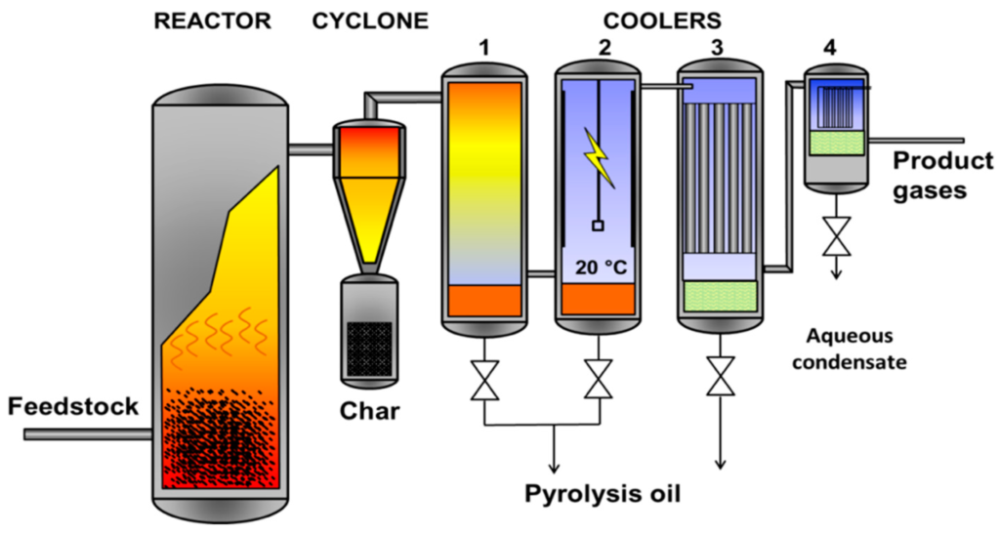

# Advanced Reaction Engineering: Python Simulations

### This repository contains Python code used to simulate chemical reactors by solving systems of differential equations. Reaction stoichiometries and rate equations are used to create a system of ODEs, which are vectorized and solved by Runge Kutta (RK4) or ODE solvers in the SciPy library.  

#### Types of reactors studied include:
<ul> 
    <li> Plug Flow Reactor </li>
    <li> Packed Bed Reactor </li>
    <li> Batch Reactor</li>
</ul>
